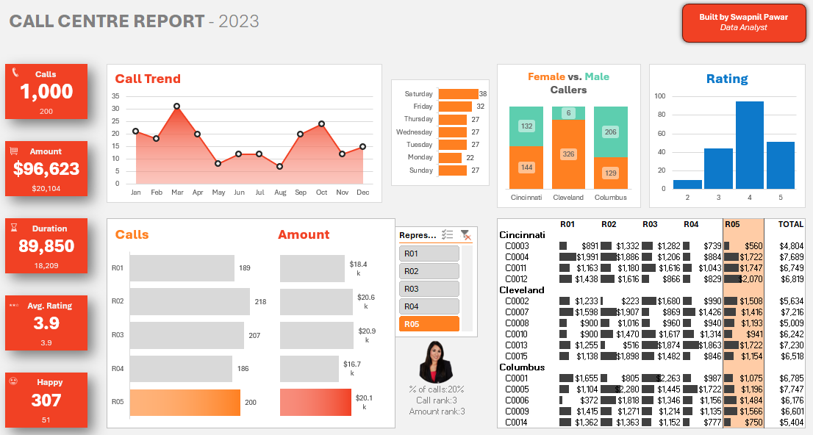

# 📊 Call Centre Dashboard — Excel

## Overview
Interactive Call Centre Performance Dashboard 
analyzing 1,000+ call records for business insights.

## Dashboard Preview

## Dashboard Features
- 📈 Call Trend Analysis — Monthly
- 💰 Revenue by Representative
- ⭐ Customer Satisfaction Rating
- 👥 Female vs Male Caller Analysis
- 🔍 Interactive Slicers & Filters

## Skills Used
- Pivot Tables & Pivot Charts
- Slicers & Timeline
- KPI Cards
- Data Cleaning & Formatting

## Tools
Microsoft Excel 2024

## Author
**Swapnil Pawar** | Data Analyst
🔗 [LinkedIn](https://linkedin.com/in/swapnil-pawar)
